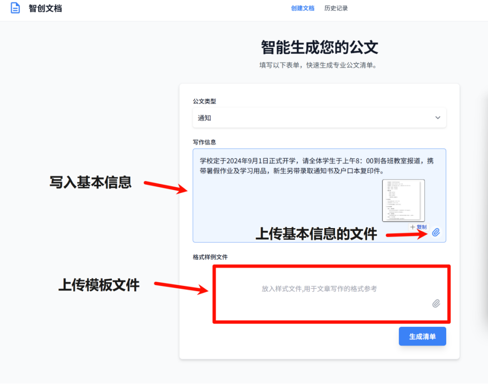
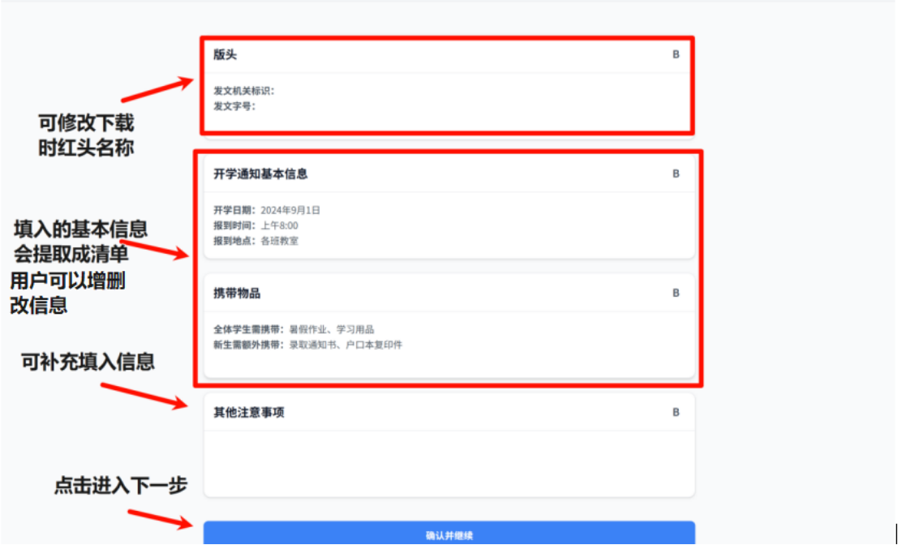
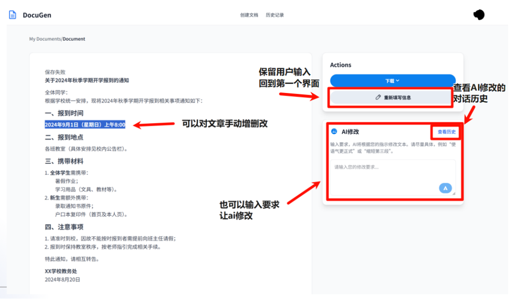
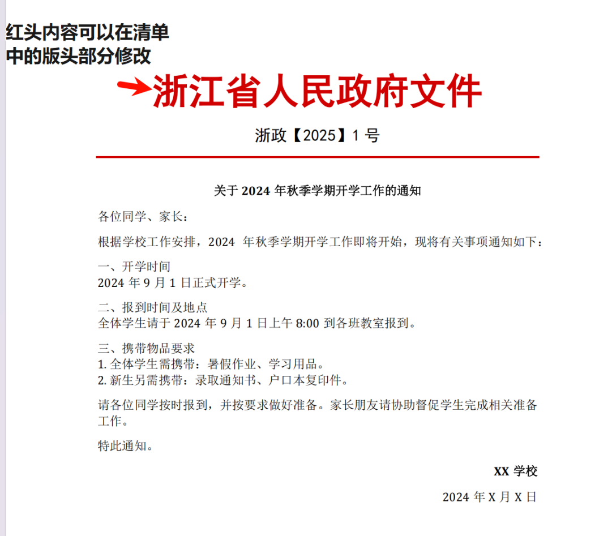
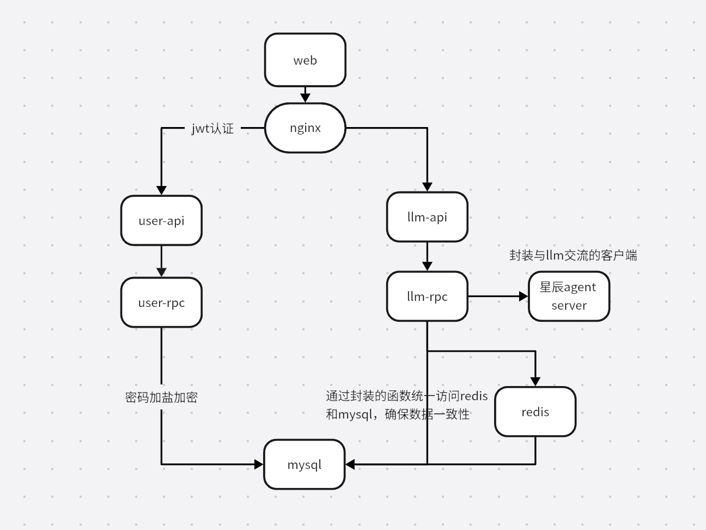
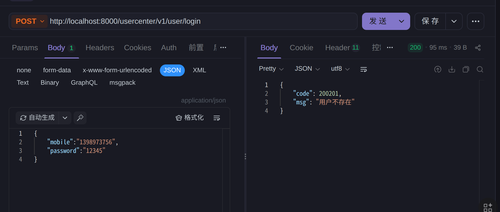
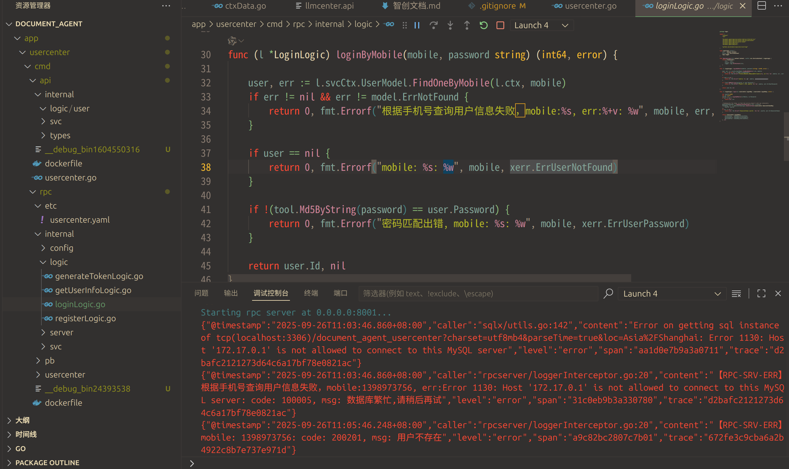

# **智创文档 (AI-Powered Document Generation Agent)**

**项目演示地址：** [http://47.98.215.181:8010/](http://47.98.215.181:8010/)

## **📖 项目简介**

## 🚀 智创文档：从“模糊想法”到“清晰蓝图”的公文 AI 写作助手

### 🤔 AI 写作的烦恼，你是否也遇到过？
你告诉 AI “帮我写份年度总结”，它却给了一篇空洞的模板。你提供了许多细节，它又抓不住重点。问题的核心在于：AI 无法整理你脑中零散的想法。

### ✨ 我们的方案：让 AI 成为你的“需求规划师”
**智创文档** 不只是一个写作工具，更是一个智能的需求规划与梳理平台。

当你输入初步的想法后，它不会立即开始写作，而是会：
1.  **读懂你的意图**：智能分析你的文字，提取出像【报告周期】、【关键业绩】这样的核心信息。
2.  **生成专属“创作清单”**：将提取的信息结构化地呈现给你，同时，基于强大的逻辑推理能力，提示你补充【面临的挑战】、【明年规划】等不可或缺的内容。
3.  **基于“蓝图”一键成文**：当你确认并填完这张清晰的“创作蓝图”后，AI 就能心领神会，一键生成结构严谨、内容详实的专业文档。

我们相信，好的文章源于好的规划。「智创文档」正是通过赋能 AI 规划能力，来确保每一次创作都能精准触达你的预期。

### 🔧 技术实现
为支撑这一创新流程，项目后端采用了**Go-Zero**框架构建的**微服务架构**，确保了系统的健壮性与可扩展性。所有服务均通过**Docker Compose**进行容器化管理，实现了快速、可靠的一键部署。

## **🚀 核心功能**

让用户选择公文类型、公文写作信息、上传模板文件

大模型自动提取基本信息，用户可查看、修改、增加、删除。若模型还需其他信息才能更好的生成公文，会在这里列出还需要什么信息，让用户填写

大模型根据用户填写的公文信息生成最终公文，可以手动修改、让大模型修改、保存、下载

下载的文件

特点：
* **引导用户填写公文所需信息**：可自动提取用户上传的文件中所包含的生成公文所需信息，并展示给用户，让用户进行修改。智能提示用户，若需要生成公文还需提供什么信息。
* **实时流式响应**：核心聊天接口采用 **SSE (Server-Sent Events)** 技术，实现服务端到客户端的流式输出，为用户带来了流畅的“打字机”式生成体验。  
* **多种格式导出**：支持将生成的 Markdown 文档一键转换为 **PDF** 或 **DOCX** 格式并下载。  
* **上下文感知**：支持上传参考文件（如 .docx, .pdf, .txt），系统能够提取文件内容作为上下文，辅助大模型生成更贴切的文档。  
* **历史会话管理**：用户可以查看、管理和回溯自己的历史创作记录。  


## **🏛️ 系统架构**

本项目采用以后端为核心的微服务架构，将系统拆分为**用户中心**和**大模型中心**两大核心服务。每个服务包含独立的 API 和 RPC 模块，确保了职责分离和独立扩展的能力。


* **服务间通信**：服务间通过 **etcd** 进行服务发现与注册，使用 **gRPC** 进行高效的内部通信。  
* **客户端通信**：前端通过 **RESTful API** 与后端进行交互，核心生成接口则采用 **SSE** 进行流式通信。  
* **数据持久化**：使用 **MySQL** 存储用户、会话、消息等核心业务数据。  
* **性能优化**：引入 **Redis** 作为**旁路缓存（Cache-Aside）**，缓存用户与大模型对话的热点数据，以降低数据库负载并加速数据读取。  
* **部署**：整个应用栈（Go 服务、MySQL、Redis、etcd）由 **Docker Compose** 统一编排，实现一键式部署和环境隔离。

## **⭐ 技术亮点**

除了核心的微服务架构外，本项目在开发过程中还融入了多项现代化的后端设计实践，以提升代码质量、可维护性和系统健壮性。

#### **1\. 精心设计的领域驱动分层**

* **清晰的职责划分**：在 logic (业务逻辑), model (数据模型), svc (服务上下文), internal/llm (外部服务客户端) 等目录结构中，我们遵循了领域驱动设计（DDD）的思想，确保了各层职责单一，高内聚低耦合。  
* **独立的 RPC / API 模块**：每个微服务都包含独立的 api 和 rpc 模块。api 层负责对外暴露 RESTful 接口和参数校验，而 rpc 层则封装了核心的业务逻辑。这种分离使得接口定义和业务实现可以独立演进。

#### **2\. 优雅封装的大模型客户端**

为了解耦业务逻辑与第三方大模型服务（星辰大模型）的复杂交互，我们封装了一个 “星辰agent server”：

* **统一的调用入口**：将对话、续写等所有与大模型 API 的交互都封装在客户端内部，业务层只需调用简单的方法，无需关心底层的 HTTP 请求、认证和流式数据处理。  
* **健壮的流式处理**：客户端内部处理了 SSE 的数据流解析，将原始的 SSE 事件转换为业务层易于处理的数据结构，并能稳定地将数据块通过 gRPC 流推送到 API 层。  
* **配置驱动**：API Key, Secret, URL 等都通过配置文件注入，便于在不同环境中切换。

#### 3. 基于 AOP 的中间件设计

我们利用 Go-Zero 框架的中间件能力和 gRPC 的拦截器（Interceptor）实现了面向切面编程（AOP），将通用功能从业务逻辑中剥离：

* **JWT 认证**：通过 Go-Zero 的中间件，我们为需要授权的 API 路由统一添加了 JWT 令牌校验，业务 logic 只需从 context 中获取用户信息即可。
* **统一日志与错误处理**：设计并实现了一个 gRPC 拦截器，将错误处理与日志记录优雅地合二为一。业务代码只需通过 `error wrapping` 返回一个自定义错误，中间件便会自动对外返回结构化的业务错误码，对内记录包含完整堆栈的详细日志，极大地提升了开发体验和系统的可维护性。

    <details>
    <summary>👉 点击展开，查看「统一日志与错误处理」中间件设计详解</summary>
    

    #### 设计哲学
    
    传统开发模式中，业务代码通常需要分别处理错误返回和日志记录，这不仅繁琐，而且容易遗漏。我们的核心思想是：**开发者只需关注业务并通过包装（`wrapping`）返回一个错误，后续的一切都交给中间件**。
    
    * **对于前端**：返回一个清晰、结构化的业务错误码（`code`）和错误信息（`msg`）。
    * **对于后端日志**：记录包含完整堆栈信息、上下文和附加数据的详细错误，便于快速定位和调试问题。
    
    #### 实现效果
    
    以“用户登录”为例：
    
    **1. 业务逻辑代码**
    
    在 `logic` 层，当发现用户不存在时，只需包装预定义的 `xerr.ErrUserNotFound` 错误并返回。
    
    ```go
    // internal/logic/loginlogic.go
    func (l *LoginLogic) loginByMobile(mobile, password string) (int64, error) {
        // ...
        if user == nil {
            // 用户不存在，包装业务错误并附加额外信息
            return 0, fmt.Errorf("mobile: %s: %w", mobile, xerr.ErrUserNotFound)
        }
        // ...
    }
    ```
    
    **2. 前端收到的响应**
   
    中间件会自动拦截错误，并将其转换为对前端友好的 JSON 响应，完全屏蔽了后端实现细节。
    
    **3. 后端记录的日志**
    
    与此同时，中间件会将包含堆栈追踪和上下文（如 `mobile`）的完整错误信息异步记录到日志系统中，极大提高了调试效率。
    
    #### 中间件核心代码
    
    ```go
    // internal/server/interceptor/loggerinterceptor.go
    func LoggerInterceptor(ctx context.Context, req interface{}, info *grpc.UnaryServerInfo, handler grpc.UnaryHandler) (resp interface{}, err error) {
        resp, err = handler(ctx, req)
        if err != nil {
            var codeErr *xerror.CodeMsg
            if errors.As(err, &codeErr) {
                // 1. 记录完整的原始错误信息
                logx.WithContext(ctx).Errorf("【RPC-SRV-ERR】 %+v", err)
                // 2. 将自定义错误转换为 gRPC status error 返回给调用方
                err = status.Error(codes.Code(codeErr.Code), codeErr.Msg)
            } else {
                logx.WithContext(ctx).Errorf("【RPC-SRV-ERR】 %+v", err)
            }
        }
        return resp, err
    }
    ```
    </details>

#### **4\. 保证数据一致性的缓存架构（仓库模式）**

为了解决引入 Redis 缓存后，多业务路径（如“AI 修改”和“用户手动修改”）下可能出现的数据不一致问题，我们设计了 **DocumentRepository** 层来统一处理数据访问，并实施了经典的 **“旁路缓存”（Cache-Aside Pattern）** 策略：

* **读操作**：  
  1. 应用先请求 **Redis 缓存**。  
  2. 若缓存命中，则直接返回数据。  
  3. 若缓存未命中，则查询 **MySQL 数据库**。  
  4. 从数据库查到数据后，**将其写入缓存**（设置过期时间），然后返回给应用。  
* **写操作（更新/删除）**：  
  1. **先更新数据库**。  
  2. **再直接删除缓存**。

这种“读时写入，写时失效”的策略，通过 **Repository 层的统一封装**，从架构层面根治了脏数据问题，对业务代码完全透明，保证了系统的数据一致性。

## **⚡ 性能优化**

在开发过程中，我们对系统的性能瓶颈进行了分析和优化。通过引入 Redis 缓存与仓库模式架构，系统处理高并发请求的能力得到了质的飞跃。

我们使用 hey 工具对edit接口进行压力测试（-n 2000 个总请求，-c 100 个并发用户）。由于大模型的API返回速度存在不确定性，我们分别测试了模拟大模型和真实调用大模型两种场景，以全面评估优化效果。

在缓存全部命中的理想情况下，取得了以下成果：

场景一：模拟大模型返回
| 指标 | 优化前 (直连数据库) | 优化后 (引入 Redis 缓存) | 提升幅度 |
| :---- | :---- | :---- | :---- |
| **QPS (每秒请求数)** | 494 | 818 | **\+65.4%** |
| **平均延迟** | 199.1ms | 93.2ms | **\-53.2%** |
| **P99 延迟** | 2.6s | 602ms | **\-77.1%** |

场景二：真实调用大模型（模拟线上环境）
（注：为保证测试稳定性，此处大模型固定返回15个字）
| 指标 | 优化前 (直连数据库) | 优化后 (引入 Redis 缓存) | 提升幅度 |
| :---- | :---- | :---- | :---- |
| **QPS (每秒请求数)** | 53.8 | 74.1 | **\+37.7%** |
| **平均延迟** | 895ms | 850ms | **\-5.1%** |
| **P99 延迟** | 3.87s | 3.14s | **\-18.9%** |


结论分析

**模拟测试的结果（场景一）** 完美地展示了缓存策略的理论上限。P99 延迟从 2.6 秒优化至 602 毫秒的惊人表现，证明我们已成功根除数据库在高并发下的性能瓶颈，极大地提升了系统自身的健壮性和可靠性。

**真实调用大模型（场景二）** 的结果，则有力地验证了该优化在生产环境中的实际价值。尽管大模型自身的响应耗时成为了新的主要耗时点，导致延迟降低比例不如模拟测试中显著，但我们依然取得了核心指标的坚实增长：

- **吞吐量（QPS）实打实地提升了 37.7%** ，这意味着系统在真实负载下能够服务更多的并发用户。

- 更关键的是，**P99 延迟降低了 18.9%** ，从 3.87 秒降至 3.14 秒。这表明缓存策略成功**消除了数据库的性能抖动**，使得系统在高压下的响应更为稳定，为用户提供了一致性更好的使用体验。

综上所述，两组测试相互印证，不仅量化了消除数据库瓶颈所带来的巨大性能提升，也证实了该优化在实际应用场景中能产生显著的、可衡量的商业价值。

## **🛠️ 技术栈**

| 分类 | 技术 | 描述 |
| :---- | :---- | :---- |
| **后端语言** | Go | 高性能、高并发的现代化后端开发语言。 |
| **后端框架** | Go-Zero | 一个集成了各种工程实践的 web 和 rpc 框架，简化了微服务开发。 |
| **数据库** | MySQL 8.0 | 关系型数据库，用于持久化存储核心业务数据。 |
| **缓存** | Redis | 高性能键值数据库，用作旁路缓存以提升系统性能。 |
| **服务治理** | etcd | 用于服务注册与发现，是微服务架构中的关键组件。 |
| **通信协议** | RESTful API, gRPC, SSE | 分别用于前后端交互、服务间通信和实时流式响应。 |
| **部署与运维** | Docker, Docker Compose | 实现应用的容器化和一键式编排部署。 |


## **🚀 快速开始**

### **环境依赖**

* Docker  
* Docker Compose

### **部署流程**

1. **克隆项目代码**  
   git clone  

2. **配置服务**  
   * 本项目通过 deploy/etc/\*.yaml 文件进行配置。  
   * **重要**：在首次启动前，请根据您的环境修改 llmcenterrpc.yaml 和 usercenterrpc.yaml 中的数据库连接信息、llmcenterapi.yaml 中的 JWT 密钥以及 llmcenterrpc.yaml 中的大模型 API Key/Secret 等敏感配置。  
3. 启动应用  
   - 使用 Docker Compose 一键启动所有服务： docker compose up \-d
   - 本地运行服务： 直接进入对应的微服务目录，运行对应的文件。
   - 需要注意的是，使用docker compose启动服务的时候，读取的是deploy/etc下的配置文件，而本地运行服务时，读取的是对应微服务的etc目录下的配置文件。

   服务启动后，llmcenterapi 服务将监听 8010 端口。usercenterapi 服务将监听 8000 端口。


4. 前端项目  
   本项目的前端代码在另一个独立的仓库中。请参考前端项目的 README 进行下载和启动。  
   * **前端仓库地址**:  https://github.com/2627660578/re_tzb

## **📝 API 接口概览**

以下是 llmcenter 服务提供的部分核心 API 接口：

| 方法 | 路径 | 描述 | 认证 |
| :---- | :---- | :---- | :---- |
| POST | /llmcenter/v1/chat/completions | 发起新对话或发送消息 (SSE 流式响应) | JWT |
| POST | /llmcenter/v1/chat/resume | 在工作流中断后继续流程 (SSE 流式响应) | JWT |
| POST | /llmcenter/v1/chat/edit | 根据提示编辑现有文章 (SSE 流式响应) | JWT |
| POST | /llmcenter/v1/files/download | 将 Markdown 转为指定格式 (PDF/DOCX) 并下载 | JWT |
| GET | /llmcenter/v1/conversations | 获取当前用户的会话列表 | JWT |
| GET | /llmcenter/v1/conversations/:id | 获取指定会话的详细历史消息 | JWT |
| POST | /llmcenter/v1/files/upload | 上传文件用于对话引用 | JWT |
| GET | /llmcenter/v1/public/file | 公开下载链接（通过签名校验） | 无 |
